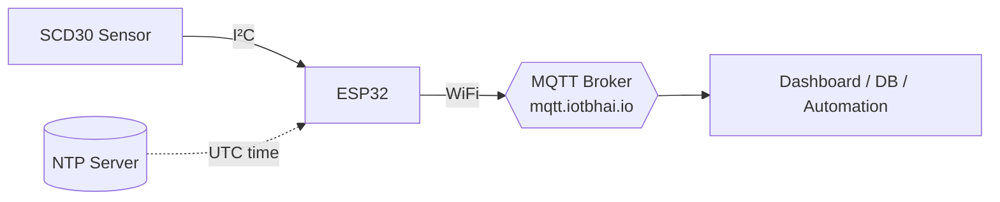
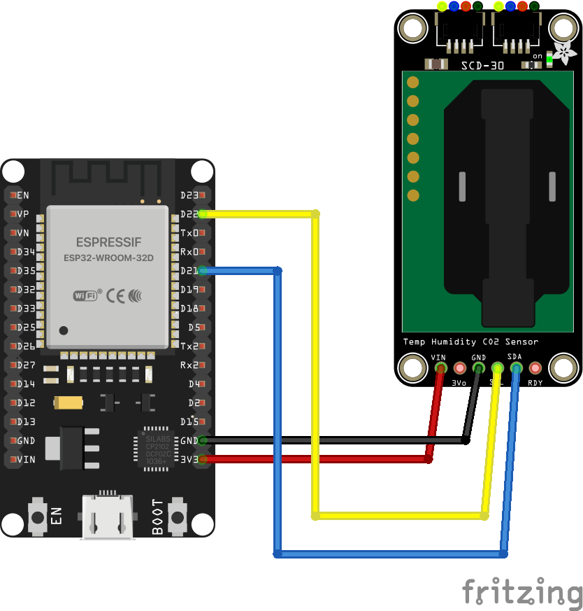

# 🌬️ CO₂ Monitor with WiFi + MQTT — ESP32 & SCD30

> Read real-time **CO₂**, **temperature**, and **humidity** from a Sensirion **SCD30** sensor, classify the air quality, and stream everything to an **MQTT broker** as clean JSON.

<p align="center">
  
  
  
  
  
  
</p>

---

## 📑 Table of Contents

- [Overview](#-overview)
- [Features](#-features)
- [Hardware Required](#-hardware-required)
- [Wiring](#-wiring)
- [Software & Libraries](#-software--libraries)
- [Configuration](#-configuration)
- [MQTT JSON Payload](#-mqtt-json-payload)
- [Air Quality Levels](#-air-quality-levels)
- [Getting Started](#-getting-started)
- [Testing the Stream](#-testing-the-stream)
- [Dashboard with mqttbhai App](#-dashboard-with-mqttbhai-app)
- [Project Structure](#-project-structure)
- [Troubleshooting](#-troubleshooting)
- [License](#-license)

---

## 🔎 Overview

This project turns an **ESP32** and a **Sensirion SCD30** NDIR sensor into a
connected air-quality node. Every few seconds the ESP32:

1. Reads **CO₂ (ppm)**, **temperature (°C)**, and **relative humidity (%)**.
2. Classifies the reading into a human-readable **air quality level**.
3. Stamps it with a real **UTC timestamp** synced over **NTP**.
4. Publishes a compact **JSON** message to an **MQTT** topic for your dashboard,
   database, or automation to consume.



---

## ✨ Features

- 📡 **WiFi + MQTT** publishing with automatic reconnect for both links
- 🧾 **Structured JSON** payload (device id, timestamp, all sensor values, air quality text)
- ⏱️ **Real UTC timestamps** via NTP (`configTime`) — no RTC needed
- 🟢 **Air quality classification** across 7 levels (Excellent → Danger)
- ⚙️ **Non-blocking loop** using `millis()` — the MQTT client stays responsive
- 🔧 **Single-file, fully configurable** sketch — edit the config block and flash

---

## 🧰 Hardware Required

| Component | Notes |
|---|---|
| ESP32 Dev Board | Any ESP32 (DevKitC, WROOM, WROVER, …) |
| Sensirion SCD30 | I²C CO₂ / temperature / humidity sensor |
| Jumper wires | 4 × female-to-female |
| USB cable | For flashing & power |

### 🛒 Components Used (buy the parts)

- **ESP32 Development Board** — [Amazon](https://amzn.to/493Wv5A) · [AliExpress](https://s.click.aliexpress.com/e/_c2IAMVUX)
- **Sensirion SCD30 (NDIR CO₂ Sensor)** — [Amazon](https://amzn.to/4d6peIH) · [AliExpress](https://s.click.aliexpress.com/e/_c34JGRGP)
- **Jumper Wires**

> _The links above are affiliate links — buying through them supports the channel at no extra cost to you._

---

## 🔌 Wiring

The SCD30 talks to the ESP32 over **I²C** and runs at **3.3 V**.

<p align="center">
  
</p>

| SCD30 Pin | ESP32 Pin | Description |
|:---:|:---:|:---|
| `VIN` | `3V3` | Power (3.3 V) |
| `GND` | `GND` | Ground |
| `SCL` | `GPIO22` | I²C clock |
| `SDA` | `GPIO21` | I²C data |

> 💡 GPIO21/GPIO22 are the ESP32's default I²C pins used by `Wire.begin()`.

---

## 📚 Software & Libraries

- **[Arduino IDE](https://www.arduino.cc/en/software)** (or Arduino CLI) with the **ESP32 board package** installed.
- Install these via **Library Manager**:

| Library | Author |
|---|---|
| Adafruit SCD30 | Adafruit |
| PubSubClient | Nick O'Leary |
| ArduinoJson (v6.x) | Benoit Blanchon |

---

## ⚙️ Configuration

All settings live in the `USER CONFIGURATION` block at the top of the sketch:

```cpp
// --- WiFi ---
const char* WIFI_SSID     = "YOUR_WIFI_SSID";
const char* WIFI_PASSWORD = "YOUR_WIFI_PASSWORD";

// --- MQTT broker ---
const char* MQTT_HOST     = "mqtt.iotbhai.io";
const uint16_t MQTT_PORT  = 1883;
const char* MQTT_USER     = "";                 // leave "" for no auth
const char* MQTT_PASSWORD = "";
const char* MQTT_TOPIC    = "iotbhai/co2";

// --- Device identity ---
const char* DEVICE_ID     = "ib_sen1";          // also used as MQTT client id

// --- NTP ---
const long GMT_OFFSET_SEC = 0;                  // 0 = UTC. GMT+6 → 6*3600
```

> ⏰ To publish **local** time instead of UTC, set `GMT_OFFSET_SEC` (e.g. `6 * 3600` for GMT+6).

---

## 📦 MQTT JSON Payload

Published to `iotbhai/co2` every `PUBLISH_INTERVAL_MS` (default **5 s**):

```json
{
  "device_id": "ib_sen1",
  "timestamp": 1724740800,
  "co2": 712.40,
  "temp": 24.31,
  "hum": 46.87,
  "air_quality": "Acceptable level (Fair)"
}
```

| Field | Type | Description |
|---|---|---|
| `device_id` | string | Unique device identifier |
| `timestamp` | number | Unix epoch **seconds** (UTC); `0` until NTP syncs |
| `co2` | number | CO₂ concentration in ppm |
| `temp` | number | Temperature in °C |
| `hum` | number | Relative humidity in % |
| `air_quality` | string | Human-readable air quality level |

---

## 🟢 Air Quality Levels

| CO₂ (ppm) | Level |
|---:|:---|
| ≤ 350 | 🟢 Healthy outside air level (Excellent) |
| ≤ 600 | 🟢 Healthy indoor climate (Good) |
| ≤ 800 | 🟡 Acceptable level (Fair) |
| ≤ 1000 | 🟠 Ventilation required (Poor) |
| ≤ 1200 | 🟠 Ventilation necessary (Bad) |
| ≤ 2500 | 🔴 Negative health effects (Very Bad) |
| > 2500 | ⚫ HAZARDOUS PROLONGED EXPOSURE (DANGER) |

---

## 🚀 Getting Started

1. **Clone** this repository.
2. Open `CO2_Monitor_WiFi_MQTT_ESP32_SCD30.ino` in the Arduino IDE.
   > If prompted, allow the IDE to place the `.ino` inside a folder of the same name.
3. Install the three libraries listed above.
4. Fill in your **WiFi** credentials in the config block.
5. Select your **ESP32 board** and **COM port**.
6. **Upload**, then open the **Serial Monitor** at **115200 baud**.

Expected serial output:

```
CO2 Monitor (WiFi + MQTT) Initializing...
SCD30 sensor found!
Connecting to WiFi "..." .... connected. IP: 192.168.1.42
NTP time sync requested.
Connecting to MQTT broker... connected.
Publish to "iotbhai/co2" OK: {"device_id":"ib_sen1",...}
```

---

## 🧪 Testing the Stream

Subscribe from any machine with [Mosquitto](https://mosquitto.org/) installed:

```bash
mosquitto_sub -h mqtt.iotbhai.io -t iotbhai/co2 -v
```

You should see a new JSON line every few seconds.

---

## 📱 Dashboard with mqttbhai App

Prefer a visual dashboard over the terminal? Use the **mqttbhai** app to
subscribe to the same broker and turn the live JSON into gauges and charts.

### 1. Connect to the broker

In the app, create a new broker connection with these settings:

| Setting | Value |
|---|---|
| Broker / Host | `mqtt.iotbhai.io` |
| Port | `1883` |
| Client ID | any unique value (e.g. `mqttbhai-dashboard`) |
| Username / Password | *(leave blank)* |
| TLS / SSL | Off |

> ⚠️ Use a **different** Client ID than the ESP32 (`ib_sen1`). MQTT brokers
> disconnect the older client when two connect with the same ID.

### 2. Subscribe to the topic

Add a subscription to:

```
iotbhai/co2
```

The device publishes one JSON message here every ~5 seconds.

### 3. Map JSON fields to widgets

The payload is JSON, so point each widget at the matching **JSON key**:

| Widget | JSON key | Suggested type | Unit / Notes |
|---|---|---|---|
| CO₂ | `co2` | Gauge / line chart | ppm (range 400–2500) |
| Temperature | `temp` | Gauge / value | °C |
| Humidity | `hum` | Gauge / value | % |
| Air Quality | `air_quality` | Text / label | Human-readable level |
| Last Seen | `timestamp` | Text / value | Unix epoch seconds (UTC) |
| Device | `device_id` | Text / label | Identifies the node |

> 💡 If a widget expects a raw number instead of JSON, enable the widget's
> **JSON path / key** option and set it to the field name above (e.g. `co2`).

### 4. Suggested layout

- A **CO₂ gauge** front-and-center (color zones matching the
  [air quality levels](#-air-quality-levels): green ≤ 600, yellow ≤ 800,
  orange ≤ 1200, red above).
- **Temperature** and **Humidity** as smaller value tiles.
- An **Air Quality** text label so the status reads at a glance.
- A **CO₂ line chart** to watch the trend over time (e.g. when a room fills up).

---

## 🗂️ Project Structure

```
4. CO2_Monitor_WiFi_MQTT_ESP32_SCD30/
├── CO2_Monitor_WiFi_MQTT_ESP32_SCD30/
│   └── CO2_Monitor_WiFi_MQTT_ESP32_SCD30.ino  # Main firmware (Arduino sketch)
├── CO2_Monitor_WiFi_MQTT_ESP32_SCD30_bb.png   # Fritzing wiring diagram
├── README.md                                   # This file
├── LICENSE                                     # MIT license
└── .gitignore
```

---

## 🛠️ Troubleshooting

| Symptom | Likely cause / fix |
|---|---|
| `Failed to find SCD30 sensor` | Check wiring & 3.3 V power; confirm I²C address `0x61` |
| Stuck on `Connecting to WiFi ...` | Wrong SSID/password, or 5 GHz-only network (ESP32 is 2.4 GHz) |
| MQTT `rc=-2` / keeps retrying | Broker host/port unreachable, or firewall blocking 1883 |
| `timestamp` stays `0` | NTP not reachable yet — give it a few seconds after WiFi connects |
| No data published | Sensor needs a moment to produce its first reading after boot |

---

## 📄 License

Released under the [MIT License](LICENSE).

---

<p align="center">
  Made with ❤️ by <b>IoT Bhai</b> · Part of the <i>Full IoT Project</i> series
</p>
